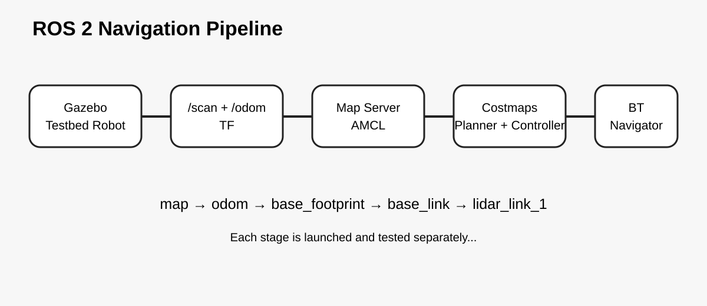
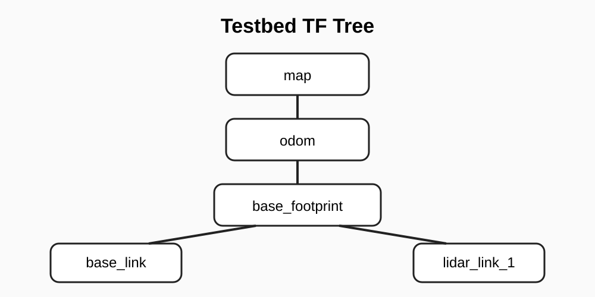

# testbed_navigation

This package contains the custom Nav2 setup for the Level 1 assignment...

## Launch files...

Map loading...

```bash
ros2 launch testbed_navigation map_loader.launch.py
```

Localization...

```bash
ros2 launch testbed_navigation localization.launch.py
```

Navigation...

```bash
ros2 launch testbed_navigation navigation.launch.py
```

## Expected TF...

```text
map -> odom -> base_footprint -> base_link -> lidar_link_1
```

`map -> odom` comes from AMCL...
`odom -> base_footprint` comes from Gazebo differential drive...

## Configuration...

- `config/amcl_params.yaml` contains localization settings...
- `config/nav2_params.yaml` contains navigation server, costmap, planner,
  controller, behavior, BT navigator, and waypoint settings...

## Useful checks...

```bash
ros2 topic echo /scan --once
ros2 topic echo /odom --once
ros2 action list | grep navigate_to_pose
ros2 lifecycle get /amcl
```




